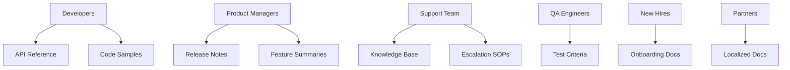

# 🧠 Module 2: Audience Analysis

> **Goal**: Enable writers and engineers to tailor documentation that meets the distinct needs of their varied audiences.

---

## 🎯 Objective

Technical documentation is not one-size-fits-all. From API reference guides to executive summaries, different stakeholders require distinct levels of technical depth, tone, and structure. This module guides you through segmenting your audience, building detailed personas, incorporating empathy, and optimizing documentation design for inclusivity, localization, and global reach.

---

## 1️⃣ Audience Segmentation

Segment your readers into actionable categories:

| Segment                    | Description                                | Needs                                       | Common Formats                              |
| -------------------------- | ------------------------------------------ | ------------------------------------------- | ------------------------------------------- |
| **Developers**             | Backend/frontend engineers, SDK users      | Deep technical insight, real examples       | API Docs, Tutorials, SDK Repos              |
| **Business Stakeholders**  | Product managers, executives, investors    | Strategic context, value-driven features    | Executive Summaries, Roadmaps, Slides       |
| **Support Staff**          | Tier 1/2 support agents, success teams     | Troubleshooting guidance, FAQs              | KB Articles, Step-by-steps, Escalation SOPs |
| **QA Engineers**           | Manual testers, automation specialists     | Expected behaviors, test data, flow clarity | Test Plans, Acceptance Criteria             |
| **New Users**              | New hires, junior engineers, beta testers  | Orientation, simplified language            | Onboarding Docs, Dev Setup Guides           |
| **International Partners** | Global collaborators, foreign contributors | Language support, region-based workflows    | Translated Docs, Visual Guides              |
| **Compliance Teams**       | Legal, audit, security officers            | Feature traceability, risk assessment       | Compliance Checklists, Change Logs          |

> 📌 Expanding beyond basic roles builds inclusive, forward-compatible documentation.

---

## 2️⃣ Build Detailed Audience Personas

Personas transform abstract reader groups into real human contexts. They help shape tone, structure, and delivery.

### 👨‍💻 Persona A: Alex the API Integrator

* **Role**: Backend Developer in Fintech
* **Goals**: Plug into REST APIs, reduce integration time, access code examples
* **Challenges**: Sparse API docs, undocumented edge cases
* **Preferred Docs**: Swagger specs, Postman collections, curl examples

### 🧑‍💼 Persona B: Brenda the Product Manager

* **Role**: SaaS Product Lead
* **Goals**: Communicate features to stakeholders, evaluate product impact
* **Challenges**: Too much jargon, unclear timelines
* **Preferred Docs**: Release notes, timelines, executive summaries

### 👩‍🔧 Persona C: Sam the Support Agent

* **Role**: Tier 1 Technical Support
* **Goals**: Resolve tickets quickly, follow consistent escalation paths
* **Challenges**: Missing context, siloed knowledge bases
* **Preferred Docs**: Troubleshooting trees, KB workflows, screenshots

### 👩‍🔬 Persona D: Priya the QA Engineer

* **Role**: Automation Tester
* **Goals**: Test edge cases, automate regression flows
* **Challenges**: Poor test criteria, vague success states
* **Preferred Docs**: Detailed acceptance criteria, user stories, failure examples

### 👨‍🎓 Persona E: Kevin the New Hire

* **Role**: Entry-level Developer
* **Goals**: Ramp up quickly, clone and run apps, understand workflows
* **Challenges**: Tribal knowledge, steep learning curve
* **Preferred Docs**: Dev environment setup, architecture diagrams, glossary

### 🌎 Bonus Persona: Diego the Global Partner Engineer

* **Language**: Spanish-first
* **Challenges**: Technical terms lost in translation, UI mismatch
* **Needs**: Bilingual guides, diagrammatic flows, minimal idioms

---

## 3️⃣ Apply Personas to Documentation Design

**Mapping Content to Personas:**



**Checklist:**

* ✅ Align tone with reader experience
* ✅ Provide examples in native workflows
* ✅ Reference terminology consistently
* ✅ Link to deep dives for advanced users

---

## 4️⃣ Documentation Localization: Global Compatibility

Global audiences deserve globally accessible content.

### 🌐 Strategies for Localization:

* Use simple English and avoid region-specific idioms
* Modularize content for easy translation updates
* Use international date/time formats (ISO 8601)
* Partner with localization platforms (e.g., Crowdin, Lokalise)
* Enable RTL layout support (for Arabic/Hebrew)

### 🔄 Maintain Language Variants

* Enforce synced translation cycles with source files (e.g., `en.md`, `jp.md`)
* Avoid hardcoded UI labels in images—overlay text instead

### 🔍 Validate International Usability:

* Run beta testing with global teams
* Automate screenshots in localized environments
* Add language flags to navigation or selectors

> ✅ A localized doc isn't just translated—it's culturally and contextually tuned.

---

## 5️⃣ Inclusive & Accessible Documentation

Accessibility ensures your documentation reaches every reader, regardless of ability or neurotype.

### 🛠 Best Practices:

* Use semantic HTML (e.g., `<article>`, `<section>`, `<figure>`, `<caption>`)
* Label all form fields and buttons clearly
* Avoid relying solely on color for meaning
* Write alt-text for all images, diagrams, and charts
* Use dyslexia-friendly fonts and scalable text sizes

### ♿ Accessibility Validation Tools:

* Lighthouse (Chrome DevTools)
* axe DevTools by Deque
* WAVE Web Accessibility Tool

### 🧠 Cognitive Accessibility:

* Structure long docs with collapsible headings
* Use consistent terms (don’t swap “auth” and “authentication” randomly)
* Offer both visual (diagrams) and text explanations

---

## 6️⃣ Empathy Mapping: Bridging the Gap Between Docs and Emotion

Empathy mapping adds an emotional and psychological layer to persona-driven design.

### 📋 Empathy Map Template:

```plaintext
Think & Feel – Are they confident, confused, frustrated?
Hear – What advice or guidance are they receiving?
See – What problems or conflicting signals do they notice?
Say & Do – What actions or complaints are common?
Pain – Where do they get stuck?
Gain – What would success feel/look like?
```

### 💡 Example: Sam the Support Agent

* **Think**: “I’m not sure if this error is internal or from the customer.”
* **Feel**: Overwhelmed with vague logs
* **Pain**: Inconsistent KB articles
* **Gain**: One link with troubleshooting checklist + logs decoder

---

## 7️⃣ Workshop: The Audience Awareness Sprint

**Objective**: Reframe technical content for three distinct personas in a team setting.

### ✏️ Sprint Instructions:

1. Choose a documentation snippet (e.g., how to configure an S3 bucket)
2. Create 3 versions:

   * 🧑‍💻 Developer
   * 🧑‍💼 Product Manager
   * 👩‍🔧 Support Agent
3. Review as a group:

   * How does tone shift?
   * Are examples relevant?
   * Is length appropriate?

### 🎯 Learning Goals:

* Identify blind spots in default writing style
* Measure clarity per persona
* Build a shared team vocabulary for documentation tone

---

## ✅ Wrap-up: From Segments to Impact

Great documentation succeeds not when it’s complete—but when it’s **understood, used, and appreciated** by those it’s written for.

**Key Takeaways:**

* Audience segmentation isn’t optional—it’s foundational.
* Personas drive empathy and precision.
* Inclusive and global writing broadens impact.
* Empathy transforms docs from instructions into experiences.

> 📚 Coming Next: **Module 3: Scalable Information Architecture**

---

*End of Module 2 – Audience Analysis*
